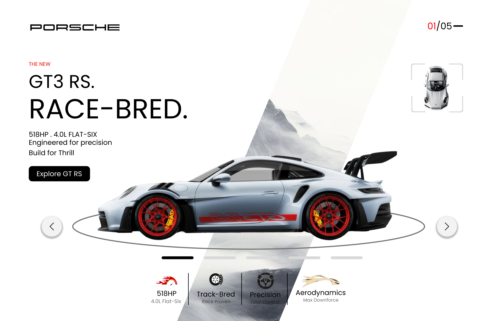
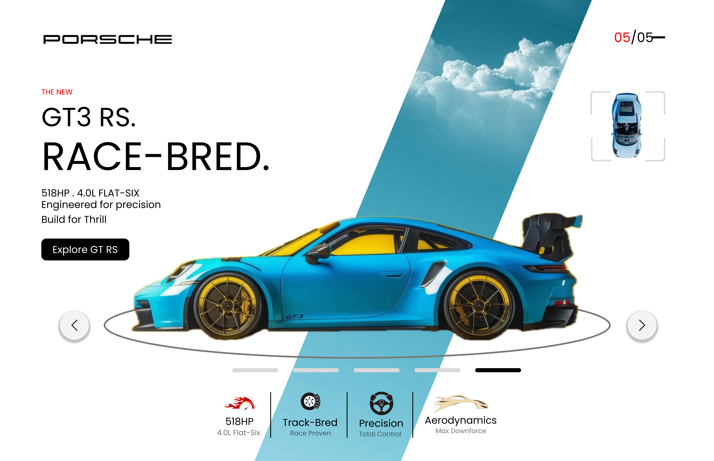
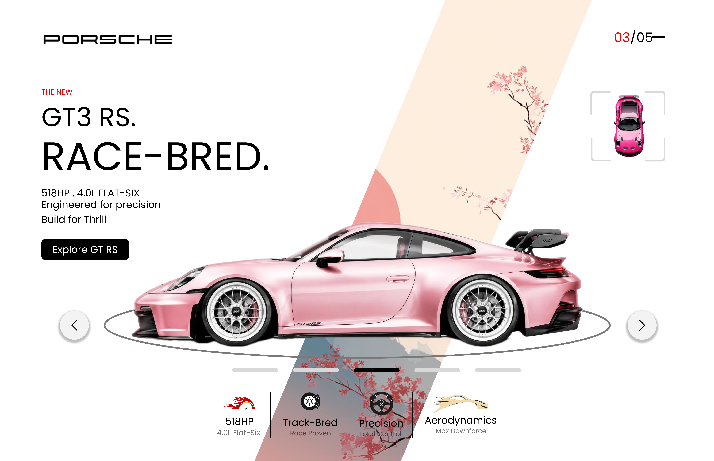
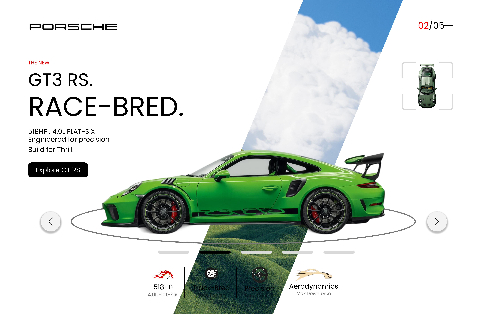

# Car UI Design

A car showcase interface concept featuring multiple vehicle color variants and a visually focused product presentation.

## 🎨 Design Preview

## ✨ Highlights

- Clean and modern visual design
- Strong focus on layout, typography, and visual hierarchy
- Designed as a UI/UX exploration in Figma

`Figma Link: YOUR_FIGMA_LINK_HERE`

## 🛠️ Tools Used

- Figma
- UI/UX Design
- Prototyping
- Visual Design

## 📁 Project Files

The images in this folder are exported previews of the design screens.

---

Part of the **Figma Designs Collection**.
