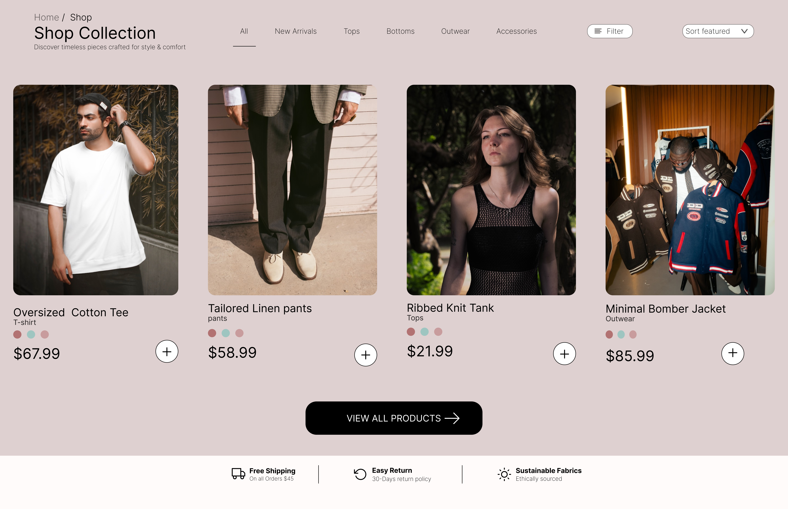
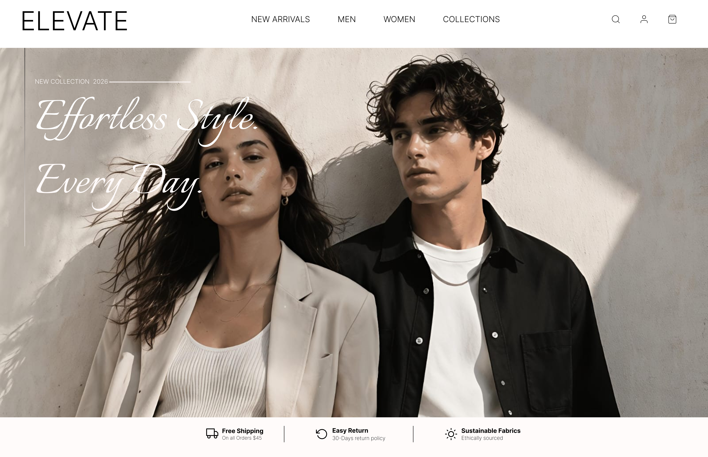

# Clothes Website Design

An e-commerce clothing website concept covering shopping, login, and product browsing screens with a clean and user-friendly interface.

## 🎨 Design Preview

## ✨ Highlights

- Clean and modern visual design
- Strong focus on layout, typography, and visual hierarchy
- Designed as a UI/UX exploration in Figma

## 🔗 Figma Prototype

> Add your Figma prototype link here.

`Figma Link: YOUR_FIGMA_LINK_HERE`

## 🛠️ Tools Used

- Figma
- UI/UX Design
- Prototyping
- Visual Design

## 📁 Project Files

The images in this folder are exported previews of the design screens.

---

Part of the **Figma Designs Collection**.
