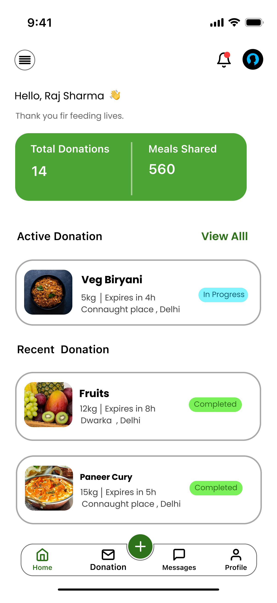

# Donor Dashboard

A mobile-first **food donation donor dashboard UI prototype** designed to let food donors create surplus-food donations, review donation information, and receive confirmation after a donation is successfully submitted.

> **Note:** The supplied ZIP contains UI screenshots/images only. No source code, package configuration, backend, database, or API files were included. Therefore, this README documents the visible product concept and screen flow rather than a specific implementation stack.

## Overview

The donor experience is centered around a simple workflow:

1. Open the donor dashboard.
2. Start creating a new food donation.
3. Enter the relevant donation and pickup information.
4. Review the donation details.
5. Submit the donation.
6. View a successful donation confirmation.

The concept is intended to make it easy for donors such as restaurants, households, caterers, or other food providers to offer surplus food to NGOs for redistribution.

## Main Features

### Donor Dashboard

The donor home screen acts as the starting point for the donation workflow.

It provides access to:

- Donor profile/dashboard information
- Donation activity
- Creating a new donation
- Previously created donation information
- Navigation to other areas of the donor experience



### Create Donation

The create-donation screen is designed for entering the information required to make surplus food available.

The workflow can capture information such as:

- Food/item information
- Quantity
- Food category/type
- Pickup information
- Availability or expiry information
- Additional donation details
- Donation submission


### Donation Details

The donation details screen presents the information associated with a donation before or after submission.

The screen is intended to make the donation information easy to review, including details such as:

- Food information
- Quantity
- Pickup details
- Timing/expiry information
- Donation status
- Relevant donor information


### Donation Successful

After a donation is submitted successfully, the confirmation screen communicates that the donation has been created.

This provides a clear completion point in the donor journey and allows the donor to continue using the application.


## User Flow

```text
Donor Dashboard
       |
       v
Create Donation
       |
       v
Enter Donation Information
       |
       v
Review Donation Details
       |
       v
Submit Donation
       |
       v
Donation Successful
```

## Screens Included

| Screen | File |
|---|---|
| Donor Dashboard | `Donor.png` |
| Create Donation | `create donation.png` |
| Donation Details | `donation details.png` |
| Donation Successful | `donations successful.png` |

## Project Structure

The supplied archive has the following relevant structure:

```text
DONOR/
├── Donor.png
├── create donation.png
├── donation details.png
└── donations successful.png
```

The original ZIP also contains `__MACOSX/` metadata files generated by macOS. These files are not part of the application UI.

## Design Highlights

- Mobile-first interface
- Simple donor-focused navigation
- Clear call-to-action for creating a donation
- Form-based donation creation workflow
- Donation review/details screen
- Explicit successful-submission confirmation
- Designed around surplus-food redistribution
- Structured flow from creation to successful submission

## Donation Lifecycle

The prototype represents the following high-level donation lifecycle:

| Stage | Description |
|---|---|
| Create | Donor enters information about surplus food |
| Review | Donation information can be reviewed |
| Submit | Donor submits the donation |
| Successful | Application confirms successful creation |

## Technology

No implementation technology can be determined from the supplied ZIP because it contains screenshots rather than source code.

If the prototype is later converted into a working application, it could be connected to:

- A mobile/web frontend
- Donor authentication
- Donation APIs
- A backend database
- NGO matching and discovery
- Location and pickup services
- Notification services
- Donation status tracking

## Getting Started

Because the supplied project contains image assets only, there is currently no build or run command.

To view the prototype:

1. Extract `DONOR.zip`.
2. Open the PNG files in any image viewer.
3. Start with `Donor.png`.
4. Follow the screens in the **User Flow** section to understand the intended donor experience.

## Future Development

Potential next steps for turning the prototype into a production application include:

- Add donor registration and login
- Add donor profile management
- Implement the create-donation form
- Add form validation
- Store donations in a backend database
- Match donations with nearby NGOs
- Add pickup scheduling
- Add donation status tracking
- Add notifications for NGO acceptance
- Add donation history
- Add editing/cancellation of donations
- Add location-based pickup information
- Add analytics for food donated and meals supported
- Connect the donor experience with the NGO dashboard

## Relationship With the NGO Dashboard

This donor interface can form one side of a larger food-donation platform:

```text
                 Food Donation Platform
                         |
          +--------------+--------------+
          |                             |
          v                             v
     Donor Dashboard              NGO Dashboard
          |                             |
     Create Donation              Find Donations
          |                             |
          +-------------+---------------+
                        |
                        v
                 Donation Matching
                        |
                        v
                 Pickup / Delivery
                        |
                        v
                  Food Distribution
```

The donor creates and submits surplus-food donations, while NGOs can discover suitable donations and coordinate their collection and distribution.

## Purpose

The concept aims to make surplus-food donation straightforward for food providers while helping NGOs access available food that can be redistributed to people in need.

---

**Project:** Donor Dashboard  
**Type:** Food donation / donor UI prototype  
**Current contents:** UI screenshots and design assets
